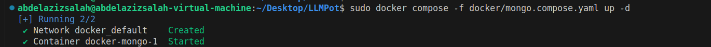

1. I modified mongo.Dockerfile to start new one instead of loading previous one
2. I run this command to start MongoDB container
    - > sudo docker compose -f docker/mongo.compose.yaml up -d
3. verify that the container is working
    - 