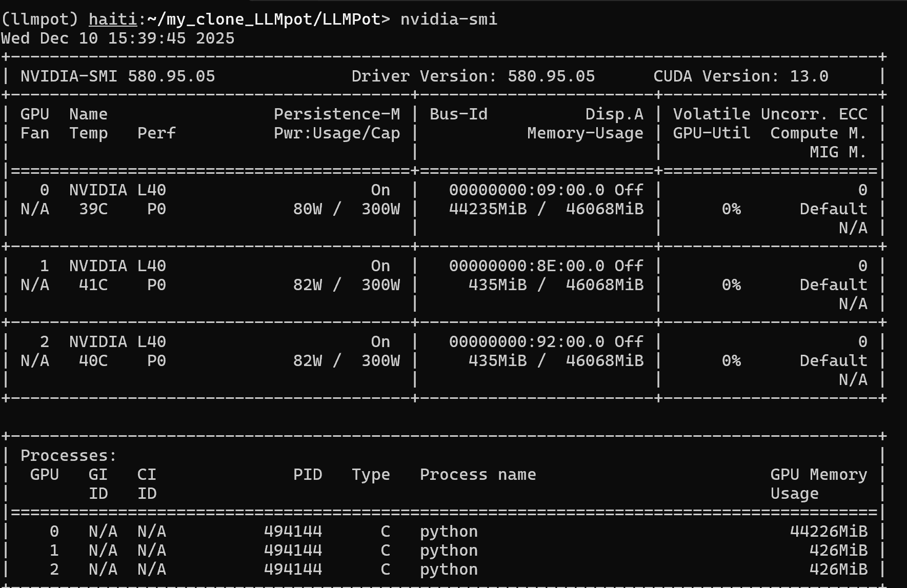

## Training error
- On running this command on the server:
  - > python -m src.finetune.multi_trainer -p 200:1,400:1,800:1,1600:1,3200:1,6400:1 -model byt5-small -cfg s7comm-protocol-emulation.json
- I get this error:
  - CUDA out of memory. Tried to allocate 20.00 MiB.
GPU 0 has 44.39 GiB total, only 8.06 MiB free.
Process is already using 43.19 GiB.
- Main reason is that GPUs on the server are almost completely full before training start.
- And the code uses all available GPUs on the server to train the model.

### Checking the avilability of GPUs
- 
  - chitthar is using the whole GPUs on the system

### How I solved this issue.
- I found that he is using GPU 0 for this, and LLMPot want to use all GPUs.
- So I forced it to use single GPU which GPU 1.
- Now I get another error, which is related to PyTorch distribution sampler
- It calls a function called DistributedSampler which requires the usage of all GPUs.

## Ploting error
- On running this command:
  - python -m plots.mbtcp.bca_rva_protocol_generalization
- I get this error:
  - FileNotFoundError: E:\GitHub\LLMPot/checkpoints/byt5-small/mbtcp-protocol-generalization.json/mbtcp-boundaries_client-c0-s1600-f1_5_15_3_6_16-v0_65535-a0_39-sc40-sr40/csv/20240423T2013/metrics.csv not found
  - This file is not even on their github repo.
- > main reason is this file was not generated yet.